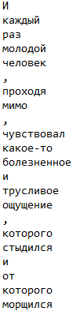

%TOC%

# [Введение]{custom-style="UnnumberedHeading1"} {.unnumbered}

Современный мир насыщен текстовой информацией, объем, разнообразие и необходимость в обработке которой постоянно растут. Это связано как с увеличением областей применения систем распознавания текста (автоматический перевод, диалоговые ассистенты, распознавание речи, суммаризация и т.д.), так и с появлением Big Data, что в первую очередь интересует крупные компании и корпорации. Данные факторы обуславливают непрекращающееся развитие методов обработки естественных языков (Natural language processing), которые являются важными инструментами, позволяющими обрабатывать и анализировать текстовую информацию с высокой точностью и скоростью.

Одним из основных этапов обработки естественного языка является анализ словоформ или морфологический анализ, заключающийся в получении основы слова и его необходимых морфологических параметров, что помогает существенно повысить качество обработки текста и сделать его более точным и информативным. Для решения стоящих перед анализом словоформ задач существуют различные алгоритмы и программы, однако их работу осложняют особенности естественных языков, в частности, русского, из-за чего появляется необходимость в оценке качества таких решений.

Цель данной работы заключается в разработке процедуры тестирования и сравнения различных морфологических анализаторов. Основная задача заключается в проведении анализа результатов работы различных морфологических анализаторов с использованием разработанной процедуры тестирования.

Эта работа имеет большую практическую значимость, так как она может быть использована для улучшения результатов обработки естественного языка и повышения качества работы различных приложений, основанных на анализе текста.
`draft_start`
Часть 1:

Современный мир насыщен текстовой информацией, объем, разнообразие и необходимость в обработке которой постоянно растут. Это связано как с увеличением областей применения систем распознавания текста (автоматический перевод, диалоговые ассистенты, распознавание речи, суммаризация и т.д.), так и с появлением Big Data, что в первую очередь интересует крупные компании и корпорации. Данные факторы обуславливают непрекращающееся развитие методов обработки естественных языков (Natural language processing), которые являются важными инструментами, позволяющими обрабатывать и анализировать такую информацию с высокой точностью и скоростью.

Одним из основных этапов обработки естсвенного языка является анализ словоформ или морфологический анализ, заключающийся в получении основы слова и его необходимых морфологических параметров, что помогает существенно повысить качество обработки текста и сделать его более точным и информативным. Результатом такого анализа является набор данных о тексте, который, пройдя еще несколько этапов, передается на вход языковой модели (трансформера), например, BERT, GPT-1 и т.д.

Для решения задач анализа словоформ существуют различные алгоритмы и программы, однако их работу осложняют некоторые особенности естественных языков, в частности, русского, из-за чего появляется необходимость в оценке качества таких решений.

Цель данной работы заключается в разработке процедуры тестирования и сравнения различных морфологических анализаторов. Основная задача заключается в проведении анализа результатов работы различных морфологических анализаторов с использованием разработанной процедуры тестирования.

Эта работа имеет большую практическую значимость, так как она может быть использована для улучшения результатов обработки естественного языка и повышения качества работы различных приложений, основанных на анализе текста.

Часть 2:

Конечной целью обработки естественного языка является автоматическое понимание содержания текста и извлечение из него нужной информации. Однако, перед тем как приступать к такому анализу, необходимо выполнить предварительную обработку текста, в том числе анализ его словоформ.

Анализ словоформ является важным этапом при обработке естественного языка. Этот процесс включает в себя определение грамматических характеристик каждого слова в предложении, а также выделение его леммы, то есть нормальной формы. Для выполнения анализа словоформ используются морфологические анализаторы, которые могут быть основаны на различных подходах.

Цель данной работы заключается в разработке процедуры тестирования и сравнения различных морфологических анализаторов и их реализации на языке программирования C#. Основная задача заключается в проведении анализа результатов работы различных морфологических анализаторов с использованием разработанной процедуры тестирования.

Эта работа имеет большую практическую значимость, так как она может быть использована для улучшения результатов обработки естественного языка и повышения качества работы различных приложений, основанных на анализе текста.

`Про конкретные области применения`

`Про сложности анализа русского языка (после того, как изучу существующие методы)`
`draft_end`
# Объект, предмет, проблема и цель исследования

## Характеристика анализа словоформ

Обработка естественного языка -- комплексный процесс, состоящий из нескольких этапов анализа:

1. Морфологический анализ;
2. Синтаксический анализ;
3. Семантический анализ.

Морфологический анализ -- первый этап в обработке естественного языка, где каждая словоформа в тексте разбирается на составляющие: основа, окончание, приставка и суффикс. Это позволяет определить грамматические характеристики слова, такие как часть речи, число, род, падеж и т. д. Важно отметить, что для каждого языка используются свои правила морфологического анализа.

Синтаксический анализ -- следующий этап, где анализируется связь между словами в предложении, и определяется, как они объединяются в грамматические конструкции, такие как фразы и предложения. Семантический анализ -- последний этап, где определяется смысл текста и его контекста.

Помимо них выделяют этап лексического анализа, который заключается в первичной обработке текста, определении языка, на котором он написан, и разбиении текста на следующие фрагменты [@чеповский2015интуит]:

* непрерывные последовательности алфавитно-цифровых символов;
* непрерывные последовательности пробельных символов;
* отдельные символы прочих классов.

В дальнейшем результаты работы данного этапа будут сформированы вручную без использования специальных программ или инструментов.

Исходя из вышенаписанного, можно утверждать, что морфологический анализ играет важную роль в обработке естественного языка, так как он дает возможность понимать структуру предложения и правильно интерпретировать его смысл. Например, знание того, что слово является глаголом, позволяет определить, что это действие или процесс, который описывается в предложении.

Для последующего анализа и оценки работы инструментов морфологического анализа дополнительно дадим определения ряду терминов. В таблице [-@tbl:definitions] описаны необходимые термины, а также примеры их отношения к слову "бегал".

| Термин     | Определение                                                              | Пример                      |
| ---------- | ------------------------------------------------------------------------ | --------------------------- |
| Словоформа | Слово в определенной грамматической форме (как оно встречается в тексте) | бегал                       |
| Лемма      | Нормальная форма слова                                                   | бегать                      |
| Лексема    | Набор всех форм одного слова                                             | бегала, бегал, бегаю и т.д. |
| Основа     | Неизменяемая часть слова                                                 | бега                        |

Table: Термины морфологического анализа. {#tbl:definitions}

Несмотря на то, что исследования в области обработки текстов на естественных языках ведутся с конца 20 века, сложность процесса все также обуславливается неоднозначностью языковых правил, первопричиной которой являются обосенности естественных языков. Примеры таких особенностей представлены в таблице [-@tbl:nl_specials_table]. В первую очередь вышеописанные проблемы сказываются на морфологическом анализе.

| Особенность                    | Описание                                                                                                                     |
| ------------------------------ | ---------------------------------------------------------------------------------------------------------------------------- |
| Флективность                   | Особенность языка, при которой доминирует словоизменение при помощи флексий — формантов, сочетающих сразу несколько значений |
| Многозначность языковых единиц | Языку присущи такие явления, как полисемия, омонимия, синонимия                                                              |
| Комплексные словоформы         | Наличие в текстах аббревиатур, сокращений и сложносочиненных слов                                                            |
| Изменчивость                   | Подвижность лексического уровня языка, появление новых слов                                                                  |
| Иноязычные слова, неологизмы   | Слова, которые могут быть неизвестны системе морфологического анализа                                                        |

Table: Особенности естественных языков. {#tbl:nl_specials_table}

Для решения описанных проблем морфологический анализ декомпозируют на несколько методов неполного морфологического анализа, к которым относятся стемминг и лемматизация. Несмотря на то, что эти методы рассматриваются как части общего процесса, для решения некоторых специфичных задач, например, реализации поисковых алгоритмов [@ковалевский2022автоматическая], их могут использовать полноценно вместо полного морфологического анализа. Такой подход обусловлен сложностью и большой трудоемкостью полного морфологического анализа, а также избыточностью получаемых им результатов.

Лемматизация -- это процесс приведения слова к его базовой форме, которая называется леммой. Например, словоформы "мыть", "моет", "моют" приводятся к лемме "мыть". Это позволяет упростить дальнейший анализ и сократить количество форм слова для обработки.

Стемминг -- процесс, при котором слово приводится к основе или псевдооснове. Визуальное представление псевдоосновы показано на рисунке [-@fig:stem]. Можно заметить, что она не имеет ничего общего с лингвистическим термином "основа", который описывает часть слова без окончания. Для языков Евразии, к которым также относится и русский, алгоритмы стемминга являются аналитическими [@чеповский2015интуит], из чего можно сделать вывод, что эффективность их работы не равна 100%.

![Модель слова русского языка с обозначением псевдоосновы S [@гращенко2018snowforce]](./sources/images/stem.png){#fig:stem}

## Характеристика морфоанализаторов

Для автоматического выполнения морфологического анализа текстов используют специальные программы -- морфологические анализаторы (морфоанализаторы). К таким программам мы будем относить инструменты, позволяющие получить не только значения морфологических характеристик словоформы, но и ее нормальную форму и псевдооснову.

Для каждого из представленных инструментов будут описаны примеры использования на заранее подготовленных тестовых текстах. 

### Snowball

Snowball -- это проект Мартина Портера, основанный на его алгоритме стемминга, написанном в 1980 году. Он предоставляет возможность использовать алгоритм выделения псевдооснов через программу, доступную на официальном сайте. Вызов программы производится следующим образом: stemwords -l \<language\> -i \<input file\> [-o \<output file\>]. Вызов содержит следующие обозначения:

* language - язык, используемый в обрабатываемом файле.
* input file - путь к исходному файлу, текст которого будет обработан алгоритмом libstemmer.
* output file - путь к файлу, в который будут записаны результаты стемминга.

Snowball является самым распространенным алгоритмом стемминга для русского языка, реализации которого существуют для многих языков программирования: Python, Java, C# и другие. Существуют модификации алгоритма, направленные на улучшение показателей его работы, однако оригинальный Snowball остается приоритетным в использовании инструментом.

Алгоритм способен обрабатывать лишь отдельные слова, расположенные на разных строках. По итогу в полученном файле на месте исходных слов будут представлены их псевдоосновы. Snowball не позволяет получить морфологические характеристики.

Рассмотрим работу Snowball, для чего предварительно разделим тестовые тексты на словоупотребления путем переноса каждого из них на отдельную строку, как показано на рисунке [-@fig:phrase_by_lines]. Получившиеся результаты показаны в таблице [-@tbl:snowball_results].

{#fig:phrase_by_lines}

| Исходный текст                                                                                                                             | Результат стемминга                                                                                           |
| ------------------------------------------------------------------------------------------------------------------------------------------ | ------------------------------------------------------------------------------------------------------------- |
| И каждый раз молодой человек, проходя мимо, чувствовал какое-то болезненное и трусливое ощущение, которого стыдился и от которого морщился | И кажд раз молод человек, проход мим, чувствова какое-т болезнен и труслив ощущен, котор стыд и от котор морщ |
| На заводе не хватает стали                                                                                                                 | На завод не хвата стал                                                                                        |
| Масло стекло на пол                                                                                                                        | Масл стекл на пол                                                                                             |

Table: Результаты применения алгоритма Snowball. {#tbl:snowball_results}

### TreeTagger

TreeTagger -- алгоритм морфологической разметки текста, разработанный Хелмутом Шмидом. В его основе лежит процесс обработки деревьев решений (decision tree).

Алгоритм TreeTagger реализован в виде программы tree-tagger [@treetagger], вызов которой выглядит так: tree-tagger \<опции\> \<файл параметров\> {\<входной файл\> {\<выходной файл\>}}

Список доступных опций представлен в таблице [-@tbl:tt_options]

| Флаг       | Описание                                               |
| ---------- | ------------------------------------------------------ |
| token      | Вывести токены                                         |
| lemma      | Вывести лемму                                          |
| sgml       | Не помечать аннотации SGML                             |
| no-unknown | Для неизвестных лемм печатать токен вместо \<unknown\> |

Table: Опции, доступные в утилите tree-tagger. {#tbl:tt_options}

Файл параметров (parameter file) -- файл, генерируемый программой train-tree-tagger.

Входной файл представляет собой текстовый файл, в котором на отдельных строках располагается по одному токену (слово, знак пунктуации или скобка). В каждом файле не должно быть более 1000 символов.

Рассмотрим работу приложения tree-tagger с использованием флагов, перечисленных в таблице [-@tbl:tt_options]. Во входном файле будет написан текст, токенизированный путем переноса каждого слова и знака на отдельную строку. Поскольку ширина колонок в итоговой таблице меняется на каждой строке, перепишем полученные данные в более удобном для чтения варианте, как показано в таблице [-@tbl:tt_result_1].

| Словоупотребление | MSD        | Лемма       |
| ----------------- | ---------- | ----------- |
| И                 | C          | И           |
| каждый            | P--msaa    | каждый      |
| раз               | Ncmsan     | раз         |
| молодой           | Afpmsnf    | молодой     |
| человек           | Ncmsny     | человек     |
| проходя           | Vmgp---a-e | проходить   |
| мимо              | R          | мимо        |
| чувствовал        | Vmis-sma-e | чувствовать |
| какое-то          | R          | какое-то    |
| болезненное       | Afpnsaf    | болезненный |
| и                 | C          | и           |
| трусливое         | Afpnsaf    | трусливый   |
| ощущение          | Ncnsan     | ощущение    |
| которого          | P--msga    | который     |
| стыдился          | Vmis-smm-e | стыдиться   |
| и                 | C          | и           |
| от                | Sp-g       | от          |
| которого          | P--msga    | который     |
| морщился          | Vmis-smm-e | морщиться   |

Table: Результаты анализа текста программой tree-tagger. {#tbl:tt_result_1}

Ключевой колонкой является MSD, поскольку в ней отражены коды морфосинтаксического описания (MorphoSyntactic Description). Каждый код является аббревиатурой от совокупности признаков анализируемого слова. Полный перечень кодов MSD и их расшифровка есть на официальном сайте. В таблице [-@tbl:tt_results_decode] представлена расшифровка данных из таблицы [-@tbl:tt_result_1].

| Словоупотребление | MSD        | Расшифровка                                                                                                |
| ----------------- | ---------- | ---------------------------------------------------------------------------------------------------------- |
| раз               | Ncmsan     | Noun Type=common Gender=masculine Number=singular Case=accusative Animate=no                               |
| проходя           | Vmgp---a-e | Verb Type=main VForm=gerund Tense=present Voice=active Aspect=perfective                                   |
| чувствовал        | Vmis-sma-e | Verb Type=main VForm=indicative Tense=past Number=singular Gender=masculine Voice=active Aspect=perfective |

Table: Расшифровка результатов анализа текста программой tree-tagger. {#tbl:tt_results_decode}

Расшифровка приведена на английском языке, и чтобы убедиться в полученном результате, переведем названия категорий на русский язык:  

* Tense -- Время
* Person -- Лицо
* Number -- Число
* Gender -- Пол
* Voice -- Залог
* Animate -- Одушевленность
* Aspect -- Вид
* Case -- Падеж

Теперь разберем работу tree-tagger с текстом, содержащим слово, трактовка морфологических признаков которого неоднозначна: стали. Результаты анализа приведены в таблицах [-@tbl:tt_result_2] и [-@tbl:tt_result_3].

| Словоупотребление | MSD        | Лемма     |
| ----------------- | ---------- | --------- |
| Множество         | Ncnsnn     | множество |
| типов             | Ncmpgn     | тип       |
| стали             | Vmis-p-a-p | стать     |

Table: Результаты анализа программой tree-tagger текста с омонимом "стали". {#tbl:tt_result_2}

| Словоупотребление | MSD        | Лемма   |
| ----------------- | ---------- | ------- |
| На                | Sp-l       | на      |
| заводе            | Ncmsln     | завод   |
| не                | Q          | не      |
| хватает           | Vmip3s-a-e | хватать |
| стали             | Ncfsgn     | сталь   |

Table: Результаты анализа программой tree-tagger текста с омонимом "стали". {#tbl:tt_result_3}

В обоих случаях под слово "стали" подразумевалось существительное (лемма "сталь"). На первый взгляд можно сказать, что TreeTagger неэффективно избавляется от неоднозначностей, однако в случаях ошибочного определения морфологических характеристик следует посмотреть, имеет ли предложение какой-то смысл, если принять решение анализатора за верное. Первое из рассматриваемых нами предложений действительно можно прочитать со словом "стали" в качестве глагола, в отличие от второго, где контекст явно указывает на принадлежность слова "стали" к необходимой нам лемме.

### Mystem

Mystem -- морфологический анализатор русского языка, разработанный Ильей Сегаловичем. На сегодняшний день исходный код инструмента закрыт, а права на него принадлежат компании "Яндекс". Mystem способен обрабатывать незнакомые слова (отсутствующие в словаре) и строить для них морфологические гипотезы.

Алгоритм mystem реализован в виде утилиты mystem [@mystem], вызов которой выглядит так: mystem \<опции\> \<входной файл\> \<выходной файл\>. Список доступных в mystem опций приведен в таблице [-@tbl:mystem_options].

| Флаг   | Описание                                                   |
| ------ | ---------------------------------------------------------- |
| n      | Построчный режим, каждое слово печатается на новой строке. |
| l      | Не печатать исходные словоформы, только леммы и граммемы.  |
| i      | Печатать грамматическую информацию, расшифровка ниже.      |
| g      | Склеивать информацию словоформ при одной лемме             |
| d      | Применить контекстное снятие омонимии                      |
| weight | Печатать бесконтекстную вероятность леммы.                 |

Table: Описание опций утилиты mystem. {#tbl:mystem_options}

На рисунке [-@fig:mystem_result_1] представлен результат обработки текста программой mystem. Интересно, что в данном случае присутствует омонимия, из-за чего, например, слово "каждый" принадлежит к нескольким частям речи: местоимение-прилагательное, местоимение-существительное, а слово "мимо" - к предлогу и наречию.

{#fig:mystem_result_1}

Для лучшего понимания рассмотрим результаты анализа нескольких слов.

Трусливое. Результатом анализа является строчка "трусливый=A=(вин,ед,полн,сред|им,ед,полн,сред)".

| Обозначение | Категория             | Значение       |
| ----------- | --------------------- | -------------- |
| A           | Часть речи            | Прилагательное |
| вин         | Падеж                 | Винительный    |
| ед          | Число                 | Единственное   |
| полн        | Форма прилагательного | Полная форма   |
| сред        | Род                   | Средний род    |
| им          | Падеж                 | Именительный   |

Table: Расшифровка результатов анализа слова "трусливое". {#tbl:mystem_decode_1}

Исходя из данных в таблице [-@tbl:mystem_decode_1], можно утверждать, что слово "трусливое" - прилагательное единственного числа среднего рода полной формы. Неоднозначным остается лишь падеж слова - именительный или винительный.

Проходя. Результатом анализа является строчка "проходить=V=непрош,деепр,несов,пе".

| Обозначение | Категория                          | Значение          |
| ----------- | ---------------------------------- | ----------------- |
| V           | Часть речи                         | Глагол            |
| непрош      | Время                              | Непрошедшее       |
| деепр       | Репрезентация и наклонение глагола | Деепричастие      |
| несов       | Вид                                | Несовершенный     |
| пе          | Переходность                       | Переходный глагол |

Table: Расшифровка результатов анализа слова "проходя". {#tbl:mystem_decode_2}

Исходя из данных в таблице [-@tbl:mystem_decode_2], можно утверждать, что слово "проходя" - переходное деепричастие непрошедшего времени несовершенного вида. В данном случае программа в качестве части речи слова указывает глагол, что может быть оправдано определением в некоторых источниках деепричастия как формы глагола, однако мы будем рассматривать деепричастие как самостоятельную часть речи.

Стыдился. Результатом анализа является строчка "стыдиться=V,несов,нп=прош,ед,изъяв,муж".

| Обозначение | Категория                          | Значение                 |
| ----------- | ---------------------------------- | ------------------------ |
| V           | Часть речи                         | Глагол                   |
| несов       | Вид                                | Несовершенный            |
| нп          | Переходность                       | Непереходный глагол      |
| прош        | Время                              | Прошедшее                |
| ед          | Число                              | Единственное             |
| изъяв       | Репрезентация и наклонение глагола | Изъявительное наклонение |
| муж         | Род                                | Мужской                  |

Table: Расшифровка результатов анализа слова "стыдился". {#tbl:mystem_decode_3}

Исходя из данных в таблице [-@tbl:mystem_decode_3], можно утверждать, что слово "стыдился" - непереходный глагол прошедшего времени несовершенного вида единственного числа изъявительного наклонения мужского рода.

Теперь рассмотри работу mystem при анализе текстов, содержащих омонимию. Чтобы избавиться от неоднозначности используется флаг -d. На рисунке [-@fig:mystem_result_2] представлен получившийся результат, который не содержит избыточной информации.

{#fig:mystem_result_2}

Однако на практике оказалась, что эффективность механизма снятия неоднозначности в Mystem ниже чем в TreeTagger. Это видно по данным из сравнительной таблицы [-@tbl:mystem_tt_compare]

| Предложение                            | Mystem                           | TreeTagger                        |
| -------------------------------------- | -------------------------------- | --------------------------------- |
| На заводе не хватает стали             | стали - глагол(становиться)      | стали - существительное(сталь)    |
| На складе завалялось много гранат      | гранат - существительное(гранат) | гранат - существительное(граната) |
| У мамы мыло стекло на пол              | мыло - существительное(мыло)     | мыло - глагол(мыть)               |
| Мама мыла посуду                       | мыла - существительное(мыло)     | мыла - глагол(мыть)               |
| Ребята стояли у дома, но я прошел мимо | мимо - наречие(мимо)             | мимо - предлог(мимо)              |

Table: Сравнение результатов снятия омонимии с помощью Mystem и TreeTagger. {#tbl:mystem_tt_compare}

### Pymorphy

Pymorphy (pymorphy2) - библиотека на языке Python, предоставляющая реализацию морфологического анализатора [@pymorphy]. С помощью Pymorphy возможно решать следующие задачи:

1. Приведение слова к нормальной форме, лемматизация.
2. Преобразование слова в нужную форму (изменение числа, падежа и т.д.)
3. Получение грамматической информации о слове (число, род, падеж, часть речи и т.д.)

Работа Pymorphy основана на предварительной обработке данных словаря OpenCorpora и дальнейшем составлении парадигм, благодаря чему в Pymrphy хранятся лишь 3 тысячи парадигмы, вместе 400 тысяч лексем.

Основная логика реализована в классе MorphAnalyzer. Объект данного класса позволяет воспользоваться методом parse, которому в качестве аргумента необходимо задать анализируемое слово (возможности анализировать целые предложения нет). Метод parse в качестве результата возвращает список объектов класса Parse. Примеры анализа слов с использованием Pymorphy приведены на рисунках [-@fig:pymorphy_steklo], [-@fig:pymorphy_granat].

{#fig:pymorphy_steklo}

{#fig:pymorphy_granat}

Разберем результаты анализа на примере слова "стекло" (рисунок [-@fig:pymorphy_steklo]). Для этого с помощью свойства tag.cyr_repr получим морфологические характеристики слова на русском языке:

1. СУЩ,неод,ср ед,им;
2. СУЩ,неод,ср ед,вн;
3. ГЛ,сов,неперех ср,ед,прош,изъяв.

Получается, что Pymorphy определил 2 части речи, к которым может принадлежать слово: существительное и глагол. Для первого варианта также имеется разделение на именительный и винительный падежи.

Особое внимание стоит обратить на параметр score. Он показывает оценку вероятности того, что данный разбор правильный. Оценивание производится на основе корпуса слов, где ищутся все неоднозначные слова со снятой неоднозначностью, для каждого слова считается, сколько раз ему был сопоставлен данный тег, и на основе этих частот вычисляется условная вероятность тега. В случае отсутствия оценки для какого-либо слова она либо считается равномерной (для словарных слов), либо оценивается на основе эмпирических правил (для несловарных слов) [@pymorphy]. Таким образом, можно считать, что при снятии омонимии будет выбран первый результат морфологического анализа со значением score ~ 0,69.

### Результаты исследования

Несмотря на существование большого числа алгоритмов стемминга, как, например, алгоритмы Портера, Ловенса, YASS, N-Gram и многие другие, широко известной и используемой программной реализацией может похвастаться только алгоритм Портера. Это обусловлено существованием проекта Snowball, в который входит не только реализация алгоритма на различных языках программирования, но и метаязык Snowball, специально разработанный для описания алгоритмов выделения псевдооснов и дальнейшей их трансляции в код на других языках программирования. Это порождает определенную проблему отсутствия альтернативных инструментов выделения псевдооснов и, следовательно, возможности их сравнения друг с другом.

Однако такая проблема не затрагивает инструменты лемматизации. Алгоритмы получения леммы от словоформы по умолчанию встроены в современные морфологические анализаторы. Для данного типа программ существует иная проблема: отсутствие универсального формата входных и выходных данных. На примере Mystem и TreeTagger заметно, как сильно могут отличаться тестовые данные и результаты анализа. И если при ручной оценки эффективности это не создает больших сложностей, то при автоматизации они обязательно возникнут.

Еще одной проблемой автоматизации оценки эффективности морфологических анализаторов является использование ими различных морфологических категорий. Например, в случае рассматриваемых нами морфоанализаторов можно выделить следующие различия:

* Для Mystem определены 14 частей речи, в то время как для TreeTagger - 12;
* В Mystem используются только 3 рода, а в TreeTagger - 3 для глагола, но 4 для существительных
* В TreeTagger для каждой большой категории (major category, существительное, глагол и так далее) определен набор атрибутов и их значений, в отличии от Mystem, где атрибуты не привязаны к каким-либо группам.

На практике эти различия можно заметить в описанных ранее исследованиях. Рассмотрим результаты анализа слова "чувствовал". У Mystem и TreeTagger они отличаются в 4 атрибутах: дополнительный 1 атрибут есть у Mystem (наклонение) и 3 - у TreeTagger (тип, форма, залог). Соответственно, нет гарантии, что в других анализаторах присутствующие в двух рассмотренных нами случаях атрибуты будут актуальны. Поэтому выделение универсального набора морфологических свойств для автоматизации оценки эффективности является более комплексной задачей и не будет рассмотрено в данной работе.

В результате описанных выше заключений задача тестирования морфоанализаторов сводится к определению показателей эффективности алгоритмов стемминга и лемматизации и дальнейшей программной реализации вычисления их значений.

# Создание процедуры тестирования морфоанализаторов

## Разработка процедуры тестирования морфоанализаторов

Оценка качества работы алгоритмов морфологического анализа очень важна, и не тривиальна, как может показаться на первый взгляд. В работе [@болховитянов2013алгоритмы] дано описание метода оценки алгоритмов выделения псевдооснов (метод оценки Пейса), который подразумевает рассмотрение присутствующих в тексте семантических групп. Выделяются следующие основные показатели оценки:

* UI -- отношение количества пар словоформ из одной семантической группы, которые были приведены к разным псевдоосновам, (GUMT, The Global Unachieved Merge Total) к общему количеству пар словоформ в данной группе (GDMT, The Global Desired Merge Total);
* OI -- отношение количества пар словоформ из разных семантических групп, которые были приведены к одной псевдооснове, (GWMT, The Global Wrongly Merged Total) к общему количеству пар словоформ из таких групп (GDNT, The Global Desired Non-Merge Total).

Для примера рассмотрим 2 небольшие семантические группы и смоделируем работу гипотетического алгоритма стемминга, результаты которой представлены в таблице [-@tbl:semantic_groups].

| Словоформа | Группа | Псевдооснова |
| ---------- | ------ | ------------ |
| ворона     | 1      | ворон        |
| вороне     | 1      | ворон        |
| вороний    | 1      | вор          |
| вор        | 2      | вор          |
| воровство  | 2      | воров        |

Table: Семантические группы и их состав. {#tbl:semantic_groups}

Для получения значения показателя UI для одной семантической группы пересчитаем все неупорядоченные пары словоформ, присутствующие в ней. У нас получится 3 пары в первой группе и 1 пара во второй группе. Теперь подсчитаем количество пар, в которых для словоформ приведены разные псевдоосновы. В первой группе их получилось 2, а во второй - 1. Таким образом, можно посчитать значение UI для каждой группы. Значение же UI для всего текста равно отношению суммы всех значений GUMT к сумме всех значений GDMT:

$$
UI = \frac{\sum_{i=1}^{2}{GUMT_i}}{\sum_{i=1}^{2}{GDMT_i}} = \frac{2 + 1}{3 + 1} = \frac{3}{4} = 0,75
$$
{#eq:ui_example}

Говоря о лемматизации, невозможно выделить подобный вышеописанному метод оценки эффективности алгоритмов, поэтому используем известные методы, применяемые для совпадающих задач. В таких условиях рассмотренный метод Пейса может быть адаптирован сооветствующим образом для работы с алгоритмами лемматизации.

Основополагающими понятиями метода Пейса являются семантические группы и связанные с ними псевдоосновы. Аналогичными в контексте лемматизации понятиями будут парадигматическая группа используемых в тексте словоформ (p) и лемма (l). Воспользовавшись приведенными в [@болховитянов2013алгоритмы] расчетами, опишем интересующие нас показатели.

Для начала переопределим классы отношений между словоформами. Опустим рассмотрение Типа 0, поскольку в данном случае данный класс изменений не имеет. Типы классов 1 и 2 определим следующим образом:

* Тип 1. Два слова представлены разными словоформами, но относятся к одной парадигме. Например, "читал" и "читаю".
* Тип 2. Два слова представлены разными словоформами и относятся к разным парадигмам. Например, "мост" и "резвый".

После определения необходимых классов составим уравнения для вычисления показателей UI и OI. Сперва определим величину DMT~p~, характеризующая количество неупорядоченных пар, которые можно получить из словоформ группы p:

`draft_start`
Не надо оставлять семантические группы, поскольку дело именно в парадигме, а не семантике.
Соответственно, надо описать типы отношений по аналогии с пособием.
`draft_end`
$$
DMT_p = \frac{1}{2}{N_p(N_p - 1)},
$$
{#eq:p_DMT_p}

где N~p~ -- количество словоформ в парадигматической группе p.

Запишем общий показатель по всем имеющимся группам:

$$
GDMT = \sum_{i=1}^{n_p}{DMT_{p_i}},
$$
{#eq:p_GDMT}

где n~p~ -- общее количество парадигматических групп в тексте.

$$
UMT_p = \frac{1}{2}\sum_{i=1}^{f_p}{N_{pi}(N_p - N_{pi})},
$$
{#eq:p_UMT_p}

где f~p~ -- количество различных лемм, выделенных в данной парадигмаической группе p,

N~gi~ -- количество словоформ в парадигматической группе p, получивших лемму i.

Тогда характеристика UMT~p~ для всех парадигматических групп вычисляется как:

$$
GUMT = \sum_{i=1}^{n_p}{UMT_{p_i}},
$$
{#eq:p_GUMT}

$$
UI = \frac{GUMT}{GDMT},
$$
{#eq:p_UI}

$$
WMT_l = \frac{1}{2}\sum_{i=1}^{f_l}{N_{li}(N_l-N_{li})},
$$
{#eq:p_WMT_l}

где f~l~ -- количество различных парадигматических групп, из представителей которых была получена лемма l,

N~li~ -- количество лемм, полученных в результате анализа словоформ из парадигматической группы i,

N~l~ -- количество словоформ, из которых была получена лемма l.

$$
GWMT = \sum_{u=1}^{n_l}{WMT_{l_u}},
$$

где n~s~ -- количество лемм, выделенных в анализируемом тексте.

$$
DNT_p = \frac{1}{2}{N_p(W-N_p)},
$$

где W -- общее количество словоупотреблений в рассматриваемом тексте.

$$
GDNT = \sum_{i=1}^{n_p}{DNT_{p_i}},
$$

$$
OI = \frac{GWMT}{GDNT},
$$

Задачи стемминга и лемматизации можно ассоциировать с задачей небинарной классификации, где словоформы выступают в роли объектов, а псевдоосновы и нормальные формы - в роли классов. Такой подход был использован в [@balakrishnan2014stemming] для сравнения работы алгоритмов стемминга и лемматизации. Тогда для оценки алгоритмов становится возможно использовать метрики качества небинарной (многоклассовой) классификации [@yandexmetrics;@microsoftmetrics].

1\. Микросредняя точность. Для вычисления метрики используется матрица ошибок, в ячейках которой располагаются усредненные значения показателей TP, FP, TN, FN. При этом для каждой парадигматической (семантической) группы вычисляются значения индивидуальных показателей, после чего сумма по всем группам делится на их количество. Расчеты элементов матрицы ошибок приведены в таблице [-@tbl:confusion_matrix]

| Обозначение | Формула                                     | Описание                                                                                     |
| ----------- | ------------------------------------------- | -------------------------------------------------------------------------------------------- |
| TP~avg~     | $TP_{avg} = \frac{\sum_{i=1}^{k}{TP_i}}{k}$ | True positive. Алгоритм правильно отнес словоформу к рассматриваемой группе i                |
| FP~avg~     | $FP_{avg} = \frac{\sum_{i=1}^{k}{FP_i}}{k}$ | False positive. Алгоритм неправильно отнес словоформу к рассматриваемой группе i             |
| TN~avg~     | $TN_{avg} = \frac{\sum_{i=1}^{k}{TN_i}}{k}$ | True negative. Алгоритм правильно отнес словоформу к отличной от рассматриваемой группе i    |
| FN~avg~     | $FN_{avg} = \frac{\sum_{i=1}^{k}{FN_i}}{k}$ | False negative. Алгоритм неправильно отнес словоформу к отличной от рассматриваемой группе i |

Table: Описание ячеек матрицы ошибок. {#tbl:confusion_matrix}

После получения значений матрицы ошибок, по аналогии с бинарной классификацией, их необходимо использовать для вычисления конкретных значений метрик качества: Precision, Recall, F-мера.

2\. Макросредняя точность.

## Программная реализация тестирования морфоанализаторов

`draft_start`
**НЕОБХОДИМОСТЬ**:

Обработка естественного языка используется в:

* маркетинге (анализ тональности, чтобы понять, как потребители воспринимают продукты и услуги, и принимать более обоснованные решения о маркетинговых кампаниях)
* *медицине (обработка медицинских данных, таких как медицинские записи, чтобы повысить эффективность диагностики и лечения)

Также в поисковых системах может использоваться обработка естественного языка для улучшения релевантности поиска и более точной индексации веб-страниц. Это помогает пользователям быстрее и легче находить нужную информацию.

В финансовой индустрии может использоваться анализ естественного языка для мониторинга финансовых новостей и сообщений в социальных сетях, чтобы разрабатывать более обоснованные инвестиционные стратегии.

В юридической практике может использоваться анализ естественного языка для автоматического поиска и классификации документов, чтобы ускорить процессы исследования и анализа.

В общем, обработка естественного языка является ключевым инструментом для улучшения эффективности в многих отраслях, ускорения процессов и повышения качества решений.

Анализ словоформ также используется в системах автоматической обработки текста, таких как спам-фильтры, классификаторы текстов и системы анализа эмоциональной окраски. Они могут использовать анализ словоформ для определения частей речи слов, для улучшения точности классификации или для анализа эмоциональных оттенков текста.

**СЛОЖНОСТИ ОБРАБОТКИ ЕСТЕСТВЕННОГО ЯЗЫКА**:

Стоит подумать о следующем:

* Совместное использование стемминга и лемматизации.
* Использование словаря, вероятности применения или контекста (пока что думаю, что они связаны) для разрешения спорных ситуаций.
* Слова-исключения будут представлять собой разницу между множеством всех лемм и множеством лемм, которые были правильно определены алгоритмом.
* Word2vec библиотека для определения семантической близости слов друг к другу.
* Проблема может заключаться как в особенностях русского языка, усложняющих работу анализаторов, так и в несовершенстве алгоритмов и возможности их улучшения.
`draft_end`

# [Заключение]{custom-style="UnnumberedHeading1"} {.unnumbered}

# [Список использованных источников]{custom-style="UnnumberedHeading1"} {.unnumbered}

