%TOC%

# [Введение]{custom-style="UnnumberedHeading1"} {.unnumbered}

Современный мир насыщен текстовой информацией, объем, разнообразие и необходимость в обработке которой постоянно растут. Это связано как с увеличением областей применения систем распознавания текста (автоматический перевод, диалоговые ассистенты, распознавание речи, суммаризация и т.д.), так и с появлением Big Data, что в первую очередь интересует крупные компании и корпорации. Данные факторы обуславливают непрекращающееся развитие методов обработки естественных языков (Natural language processing), которые являются важными инструментами, позволяющими обрабатывать и анализировать текстовую информацию с высокой точностью и скоростью.

Одним из основных этапов обработки естсвенного языка является анализ словоформ или морфологический анализ, заключающийся в получении основы слова и его необходимых морфологических параметров, что помогает существенно повысить качество обработки текста и сделать его более точным и информативным. Для решения стоящих перед анализом словоформ задач существуют различные алгоритмы и программы, однако их работу осложняют особенности естественных языков, в частности, русского, из-за чего появляется необходимость в оценке качества таких решений.

Цель данной работы заключается в разработке процедуры тестирования и сравнения различных морфологических анализаторов. Основная задача заключается в проведении анализа результатов работы различных морфологических анализаторов с использованием разработанной процедуры тестирования.

Эта работа имеет большую практическую значимость, так как она может быть использована для улучшения результатов обработки естественного языка и повышения качества работы различных приложений, основанных на анализе текста.

# Объект, предмет, проблема и цель исследования

## Характеристика анализа словоформ

Обработка естественного языка -- комплексный процесс, состоящий из нескольких этапов анализа[@sorokin2020avtomated]:

1. Морфологический анализ;
2. Синтаксический анализ;
3. Семантический анализ.

Морфологический анализ -- первый этап в обработке естественного языка, где каждое слово в тексте разбирается на составляющие: основа, окончание, приставка и суффикс[@бабина2012корпусный]. Это позволяет определить грамматические характеристики слова, такие как часть речи, число, род, падеж и т. д. Важно отметить, что для каждого языка используются свои правила морфологического анализа.

Синтаксический анализ -- следующий этап, где анализируется связь между словами в предложении, и определяется, как они объединяются в грамматические конструкции, такие как фразы и предложения. Семантический анализ -- последний этап, где определяется смысл текста и его контекста.

Помимо них также выделяют этап графематического анализа, однако в данной работе он не будет рассматриваться, а его результаты будут сформированы вручную.

Исходя из вышенаписанного, можно утверждать, что морфологический анализ играет важную роль в обработке естественного языка, так как он дает возможность понимать структуру предложения и правильно интерпретировать его смысл. Например, знание того, что слово является глаголом, позволяет определить, что это действие или процесс, который описывается в предложении.

Для последующего анализа и оценки работы инструментов морфологического анализа дополнительно дадим определения ряду терминов. В таблице [-@tbl:definitions] описаны необходимые термины, а также примеры их отношения к слову "бегал".

| Термин     | Определение                                                              | Пример                      |
| ---------- | ------------------------------------------------------------------------ | --------------------------- |
| Словоформа | Слово в определенной грамматической форме (как оно встречается в тексте) | бегал                       |
| Лемма      | Нормальная форма слова                                                   | бегать                      |
| Лексема    | Набор всех форм одного слова                                             | бегала, бегал, бегаю и т.д. |
| Стемма     | Неизменяемая часть, основа слова                                         | бега                        |

Table: Термины морфологического анализа. {#tbl:definitions}

Теперь стоит обратить особое внимание на сложности морфологического анализа, которые обсуловлены неоднозначностью языковых правил. Это может выражаться, к примеру, произвольным порядком слов в предложении, наличием слов исключений, флективности и т.д. В [@бабина2012корпусный] выделены 6 особенностей естественных языков, усложняющих процесс морфологического анализа. На их основе определим собственный набор таких особенностей, достаточный для понимания проблематики. Результаты представлены в таблице [-@tbl:nl_specials_table].

| Особенность                    | Описание                                                                                                                     |
| ------------------------------ | ---------------------------------------------------------------------------------------------------------------------------- |
| Флективность                   | Особенность языка, при которой доминирует словоизменение при помощи флексий — формантов, сочетающих сразу несколько значений |
| Многозначность языковых единиц | Языку присущи такие явления, как полисемия, омонимия, синонимия                                                              |
| Комплексные словоформы         | Наличие в текстах аббревиатур, сокращений и сложносочиненных слов                                                            |
| Изменчивость                   | Подвижность лексического уровня языка, появление новых слов                                                                  |
| Иноязычные слова, неологизмы   | Слова, которые могут быть неизвестны системе морфологического анализа                                                        |

Table: Особенности естественных языков. {#tbl:nl_specials_table}

Для решения описанных проблем морфологический анализ декомпозируют на несколько методов неполного морфологического анализа, к которым относятся стемминг и лемматизация[@гращенко2018snowforce]. Несмотря на то, что эти методы рассматриваются нами как части общего процесса, для решения некоторых специфичных задач, например, реализации поисковых алгоритмов[@ковалевский2022автоматическая], их могут использовать полноценно вместо полного морфологического анализа. Такой подход обусловлен сложностью и большой трудоемкостью полного морфологического анализа, а также избыточностью получаемых им результатов.

Лемматизация -- это процесс приведения слова к его базовой форме, которая называется леммой. Например, словоформы "мыть", "моет", "моют" приводятся к лемме "мыть". Это позволяет упростить дальнейший анализ и сократить количество форм слова для обработки.

Стемминг -- процесс, при котором слово приводится к стемме -- неизменяемой части слова. Визуальное представление стеммы показано на рисунке [-@fig:stem].

![Модель слова русского языка с обозначением стеммы S[@гращенко2018snowforce].](./sources/images/stem.png){#fig:stem}

В целом, морфологический анализ является важным этапом в обработке естественного языка, так как он является основой для последующих этапов. Без точного определения грамматических характеристик слова, синтаксический и семантический анализы могут дать неправильный результат. Поэтому, точность и эффективность обработки естественного языка напрямую зависит от качества морфологического анализа.

## Характеристика морфоанализаторов

Для автоматического выполнения морфологического анализа текстов используют специальные программы -- морфологические анализаторы (морфоанализаторы). 

При изучении практического применения анализаторов тестирование их возможностей будет основано на особенностях естественных языков, описанных ранее в таблице [-@tbl:nl_specials_table]. Для этого помимо отдельных слов на вход анализаторов будут поданы предложения, содержащие омонимии, заимствованные слова и сокращения. Очевидно, что качество работы морфоанализатора следует проверять на корпусах слов русского языка, как показано в работе [@рыкунов2022исследование], однако на данном этапе возможности инструментов будут рассмотрены лишь с целью дать характеристику их применению, а не используемым алгоритмам.

Рассмотрим характеристики морфоанализаторов, которые будут описаны в ходе анализа:

* Эффективность анализа (EA) - отношение количества словоформ, чьи морфологические признаки были корректно определены, к общему количеству словоформ;
* Снятие омонимии (SO) - отношение количества словоформ, чьи морфологические признаки были корректно определены, к общему количеству неоднозначно определяемых словоформ, если опция доступна;
* Входные параметры (IP) - список входных обязательных параметров кроме путей до файлов с текстом и результатом;
* Токенизация (Tkn) - наличие встроенного мезанизма токенизации текста;
* Тип исходного кода (TSC) - код анализатора является открытым или проприетарным;
* Обработка незнакомых слов (UW) - отношение количества словоформ, чьи морфологические признаки были корректно определены, к общему количеству незнакомых словоформ;

По перечисленным выше характеристикам будут исследованы как широко известные морфоанализаторы pymorphy, Mystem, TreeTagger, так и редко используемые Snowball, spaCy и uralicNLP.

### Pymorphy

Pymorphy (pymorphy2) - библиотека на языке Python, предоставляющая реализацию морфологического анализатора[@pymorphy]. С помощью Pymorphy возможно решать следующие задачи:

1. Приведение слова к нормальной форме, лемматизация.
2. Преобразование слова в нужную форму (изменение числа, падежа и т.д.)
3. Получение грамматической информации о слове (число, род, падеж, часть речи и т.д.)

Работа Pymorphy основана на предварительной обработке данных словаря OpenCorpora и дальнейшем составлении парадигм, благодаря чему в Pymrphy хранятся лишь 3 тысячи парадигмы, вместе 400 тысяч лексем.

Основная логика реализована в классе MorphAnalyzer. Объект данного класса позволяет воспользовать методом parse, которому в качестве аргумента необходимо задать анализируемое слово (возможности анализировать целые предложения нет). Метод parse в качестве результата возвращает список объектов класса Parse. Примеры анализа слов с использованием Pymorphy приведены на рисунках [@fig:pymorphy_steklo], [@fig:pymorphy_granat].

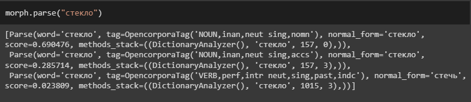{#fig:pymorphy_steklo}

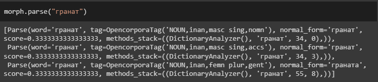{#fig:pymorphy_granat}

Разберем результаты анализа на примере слова "стекло" (рисунок [@fig:pymorphy_steklo]). Для этого с помощью свойства tag.cyr_repr получим морфологические характеристики слова на русском языке:

1. СУЩ,неод,ср ед,им;
2. СУЩ,неод,ср ед,вн;
3. ГЛ,сов,неперех ср,ед,прош,изъяв.

Получается, что Pymorphy определил 2 части речи, к которым может принадлежать слово: существительное и глагол. Для первого варианта также имеется разделение на именительный и винительный падежи.

Особое внимание стоит обратить на параметр score. Он показывает оценку вероятности того, что данный разбор правильный. Оценивание производится на основе корпуса слов, где ищутся все неоднозначные слова со снятой неоднозначностью, для каждого слова считается, сколько раз ему был сопоставлен данный тег, и на основе этих частот вычисляется условная вероятность тега. В случае отсутствия оценки для какого-либо слова она либо считается равномерной (для словарных слов), либо оценивается на основе эмпирических правил (для несловарных слов)[@pymorphy]. Таким образом, можно считать, что при снятии омонимии будет выбран первый результат морфологического анализа со значением score ~ 0,69.

### Snowball

Под Snowball понимается несколько терминов:

* Компактный язык обработки строк, используемый для реализации алгоритмов стемминга;
* Алгоритм стемминга, написанный на Snowball.

Говоря о языке, стоит отметить, что компилятор Snowball переводит программу в код на другом языке программирования. Поддерживаются языки C#, Go, Java, Javascript, Object Pascal, Python, Rust. Существует множество реализаций алгоритма SNowball - для разных естественных языков. На официальном сайте, посвященном Snowball, есть ссылки как для скачивания проектов реализации алгоритмов на C, C#, Java, так и на GitHub репозиторий, поэтому код доступен любому желающему.

Вызов программы производится следующим образом: stemwords -l \<language\> -i \<input file\> [-o \<output file\>]

* language - язык, используемый в обрабатываемом файле.
* input file - путь к исходному файлу, текст которого будет обработан алгоритмом libstemmer.
* output file - путь к файлу, в который будут записаны результаты стемминга.

Алгоритм способен обрабатывать лишь отдельные слова, расположенные на разных строках. По итогу в полученном файле на месте исходных слов будут представлены их стеммы. Snowball не позволяет получить морфологические характеристики.

Рассмотрим работу libstemmer на заранее подготовленных фразах. Предварительно эти они были вручную разбиты на слова путем переноса каждого из них на отдельную строку, как показано на рисунке [-@fig:phrase_by_lines]. Получившиеся результаты показаны в таблице [-@tbl:snowball_results].

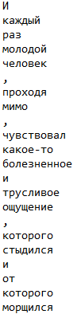{#fig:phrase_by_lines}

| Исходный текст                                                                                                                             | Результат стемминга                                                                                           |
| ------------------------------------------------------------------------------------------------------------------------------------------ | ------------------------------------------------------------------------------------------------------------- |
| И каждый раз молодой человек, проходя мимо, чувствовал какое-то болезненное и трусливое ощущение, которого стыдился и от которого морщился | И кажд раз молод человек, проход мим, чувствова какое-т болезнен и труслив ощущен, котор стыд и от котор морщ |
| На заводе не хватает стали                                                                                                                 | На завод не хвата стал                                                                                        |
| Масло стекло на пол                                                                                                                        | Масл стекл на пол                                                                                             |

Table: Результаты применения алгоритма Snowball. {#tbl:snowball_results}

### TreeTagger

TreeTagger -- алгоритм морфологической разметки текста, разработанный Хелмутом Шмидом. В его основе лежит процесс обработки деревьев решений (decision tree).

Алгоритм TreeTagger реализован в виде программы tree-tagger[@treetagger], вызов которой выглядит так: tree-tagger \<опции\> \<файл параметров\> {\<входной файл\> {\<выходной файл\>}}

Список доступных опций представлен в таблице [-@tbl:tt_options]

| Флаг       | Описание                                               |
| ---------- | ------------------------------------------------------ |
| token      | Вывести токены                                         |
| lemma      | Вывести лемму                                          |
| sgml       | Не помечать аннотации SGML                             |
| no-unknown | Для неизвестных лемм печатать токен вместо \<unknown\> |

Table: Опции, доступные в утилите tree-tagger. {#tbl:tt_options}

Файл параметров (parameter file) -- файл, генерируемый программой train-tree-tagger.

Входной файл представляет собой текстовый файл, в котором на отдельных строках располагается по одному токену (слово, знак пунктуации или скобка). В каждом файле не должно быть более 1000 символов.

Рассмотрим работу приложения tree-tagger с использованием флагов, перечисленных в таблице [-@tbl:tt_options]. Во входном файле будет написан текст, токенизированный путем переноса каждого слова и знака на отдельную строку. Поскольку ширина колонок в итоговой таблице меняется на каждой строке, перепишем полученные данные в более удобном для чтения варианте, как показано в таблице [-@tbl:tt_result_1].

| Токен       | MSD        | Лемма       |
| ----------- | ---------- | ----------- |
| И           | C          | И           |
| каждый      | P--msaa    | каждый      |
| раз         | Ncmsan     | раз         |
| молодой     | Afpmsnf    | молодой     |
| человек     | Ncmsny     | человек     |
| проходя     | Vmgp---a-e | проходить   |
| мимо        | R          | мимо        |
| чувствовал  | Vmis-sma-e | чувствовать |
| какое-то    | R          | какое-то    |
| болезненное | Afpnsaf    | болезненный |
| и           | C          | и           |
| трусливое   | Afpnsaf    | трусливый   |
| ощущение    | Ncnsan     | ощущение    |
| которого    | P--msga    | который     |
| стыдился    | Vmis-smm-e | стыдиться   |
| и           | C          | и           |
| от          | Sp-g       | от          |
| которого    | P--msga    | который     |
| морщился    | Vmis-smm-e | морщиться   |

Table: Результаты анализа текста программой tree-tagger. {#tbl:tt_result_1}

Ключевой колонкой является MSD, поскольку в ней отражены коды морфосинтаксического описания (MorphoSyntactic Description). Каждый код является аббревиатурой от совокупности признаков анализируемого слова. Полный перечень кодов MSD и их расшифровка есть на официальном сайте. В таблице [-@tbl:tt_results_decode] представлена расшифровка данных из таблицы [-@tbl:tt_result_1].

| Токен      | MSD        | Расшифровка                                                                                                |
| ---------- | ---------- | ---------------------------------------------------------------------------------------------------------- |
| раз        | Ncmsan     | Noun Type=common Gender=masculine Number=singular Case=accusative Animate=no                               |
| проходя    | Vmgp---a-e | Verb Type=main VForm=gerund Tense=present Voice=active Aspect=perfective                                   |
| чувствовал | Vmis-sma-e | Verb Type=main VForm=indicative Tense=past Number=singular Gender=masculine Voice=active Aspect=perfective |

Table: Расшифровка результатов анализа текста программой tree-tagger. {#tbl:tt_results_decode}

Расшифровка приведена на английском языке, и чтобы убедиться в полученном результате, переведем названия категорий на русский язык:  

* Tense -- Время
* Person -- Лицо
* Number -- Число
* Gender -- Пол
* Voice -- Залог
* Animate -- Одушевленность
* Aspect -- Вид
* Case -- Падеж

Теперь разберем работу tree-tagger с текстом, содержащим слово, трактовка морфологических признаков которого неоднозначна: стали. Результаты анализа приведены в таблицах [-@tbl:tt_result_2] и [-@tbl:tt_result_3].

| Токен     | MSD        | Лемма     |
| --------- | ---------- | --------- |
| Множество | Ncnsnn     | множество |
| типов     | Ncmpgn     | тип       |
| стали     | Vmis-p-a-p | стать     |

Table: Результаты анализа программой tree-tagger текста с омонимом "стали". {#tbl:tt_result_2}

| Токен   | MSD        | Лемма   |
| ------- | ---------- | ------- |
| На      | Sp-l       | на      |
| заводе  | Ncmsln     | завод   |
| не      | Q          | не      |
| хватает | Vmip3s-a-e | хватать |
| стали   | Ncfsgn     | сталь   |

Table: Результаты анализа программой tree-tagger текста с омонимом "стали". {#tbl:tt_result_3}

В обоих случаях под слово "стали" подразумевалось существительное (лемма "сталь"). На первый взгляд можно сказать, что TreeTagger неэффективно избавляется от неоднозначностей, однако в случаях ошибочного определения морфологических характеристик следует посмотреть, имеет ли предложение какой-то смысл, если принять решение анализатора за верное. Первое из рассматриваемых нами предложений действительно можно прочитать со словом "стали" в качестве глагола, в отличие от второго, где контекст явно указывает на принадлежность слова "стали" к необходимой нам лемме.

### Mystem

Mystem -- морфологический анализатор русского языка, разработанный Ильей Сегаловичем. На сегодняшний день исходный код инструмента закрыт, а права на него принадлежат компании "Яндекс". Mystem способен обрабатывать незнакомые слова (отсутствующие в словаре) и строить для них морфологические гипотезы.

Алгоритм mystem реализован в виде утилиты mystem[@mystem], вызов которой выглядит так: mystem \<опции\> \<входной файл\> \<выходной файл\>. Список доступных в mystem опций приведен в таблице [-@tbl:mystem_options].

| Флаг   | Описание                                                   |
| ------ | ---------------------------------------------------------- |
| n      | Построчный режим, каждое слово печатается на новой строке. |
| l      | Не печатать исходные словоформы, только леммы и граммемы.  |
| i      | Печатать грамматическую информацию, расшифровка ниже.      |
| g      | Склеивать информацию словоформ при одной лемме             |
| d      | Применить контекстное снятие омонимии                      |
| weight | Печатать бесконтекстную вероятность леммы.                 |

Table: Описание опций утилиты mystem. {#tbl:mystem_options}

На рисунке [-@fig:mystem_result_1] представлен результат обработки текста программой mystem. Интересно, что в данном случае присутствует омонимия, из-за чего, например, слово "каждый" принадлежит к нескольким частям речи: местоимение-прилагательное, местоимение-существительное, а слово "мимо" - к предлогу и наречию.

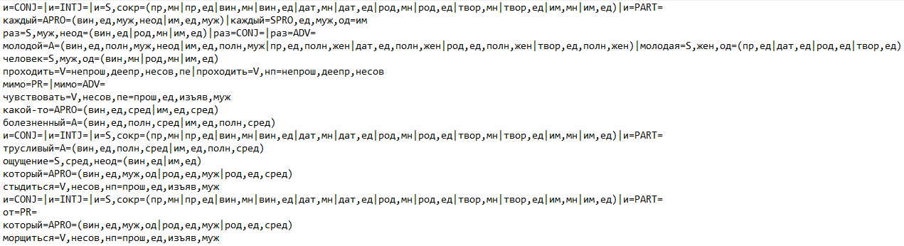{#fig:mystem_result_1}

Для лучшего понимания рассмотрим результаты анализа нескольких слов.

Трусливое. Результатом анализа является строчка "трусливый=A=(вин,ед,полн,сред|им,ед,полн,сред)".

| Обозначение | Категория             | Значение       |
| ----------- | --------------------- | -------------- |
| A           | Часть речи            | Прилагательное |
| вин         | Падеж                 | Винительный    |
| ед          | Число                 | Единственное   |
| полн        | Форма прилагательного | Полная форма   |
| сред        | Род                   | Средний род    |
| им          | Падеж                 | Именительный   |

Table: Расшифровка результатов анализа слова "трусливое". {#tbl:mystem_decode_1}

Исходя из данных в таблице [-@tbl:mystem_decode_1], можно утверждать, что слово "трусливое" - прилагательное единственного числа среднего рода полной формы. Неоднозначным остается лишь падеж слова - именительный или винительный.

Проходя. Результатом анализа является строчка "проходить=V=непрош,деепр,несов,пе".

| Обозначение | Категория                          | Значение          |
| ----------- | ---------------------------------- | ----------------- |
| V           | Часть речи                         | Глагол            |
| непрош      | Время                              | Непрошедшее       |
| деепр       | Репрезентация и наклонение глагола | Деепричастие      |
| несов       | Вид                                | Несовершенный     |
| пе          | Переходность                       | Переходный глагол |

Table: Расшифровка результатов анализа слова "проходя". {#tbl:mystem_decode_2}

Исходя из данных в таблице [-@tbl:mystem_decode_2], можно утверждать, что слово "проходя" - переходное деепричастие непрошедшего времени несовершенного вида. В данном случае программа в качестве части речи слова указывает глагол, что может быть оправдано определением в некоторых источниках деепричастия как формы глагола, однако мы будем рассматривать деепричастие как самостоятельную часть речи.

Стыдился. Результатом анализа является строчка "стыдиться=V,несов,нп=прош,ед,изъяв,муж".

| Обозначение | Категория                          | Значение                 |
| ----------- | ---------------------------------- | ------------------------ |
| V           | Часть речи                         | Глагол                   |
| несов       | Вид                                | Несовершенный            |
| нп          | Переходность                       | Непереходный глагол      |
| прош        | Время                              | Прошедшее                |
| ед          | Число                              | Единственное             |
| изъяв       | Репрезентация и наклонение глагола | Изъявительное наклонение |
| муж         | Род                                | Мужской                  |

Table: Расшифровка результатов анализа слова "стыдился". {#tbl:mystem_decode_3}

Исходя из данных в таблице [-@tbl:mystem_decode_3], можно утверждать, что слово "стыдился" - непереходный глагол прошедшего времени несовершенного вида единственного числа изъявительного наклонения мужского рода.

Теперь рассмотри работу mystem при анализе текстов, содержащих омонимию. Чтобы избавиться от неоднозначности используется флаг -d. На рисунке [-@fig:mystem_result_2] представлен получившийся результат, который не содержит избыточной информации.

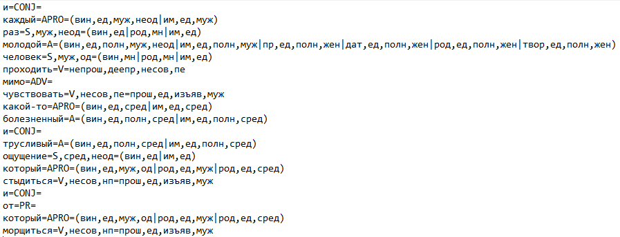{#fig:mystem_result_2}

Однако на практике оказалась, что эффективность механизма снятия неоднозначности в Mystem ниже чем в TreeTagger. Это видно по данным из сравнительной таблицы [-@tbl:mystem_tt_compare]

| Предложение                            | Mystem                           | TreeTagger                        |
| -------------------------------------- | -------------------------------- | --------------------------------- |
| На заводе не хватает стали             | стали - глагол(становиться)      | стали - существительное(сталь)    |
| На складе завалялось много гранат      | гранат - существительное(гранат) | гранат - существительное(граната) |
| У мамы мыло стекло на пол              | мыло - существительное(мыло)     | мыло - глагол(мыть)               |
| Мама мыла посуду                       | мыла - существительное(мыло)     | мыла - глагол(мыть)               |
| Ребята стояли у дома, но я прошел мимо | мимо - наречие(мимо)             | мимо - предлог(мимо)              |

Table: Сравнение результатов снятия омонимии с помощью Mystem и TreeTagger. {#tbl:mystem_tt_compare}

### spaCy, uralicNLP

Последние рассматриваемые инструменты предназначены для полноценной и многоэтапной обработки естественных языков (NLP). Необходимость их рассмотрения обосновывается более комплексным подходом к решению задач анализа текста на естественном языке, что потенциально может отразиться в большей эффективности анализа по сравнению с аналогами.

spaCy - библиотека, написанная на Python и Cython и предназначенная для NLP[@spacy]. Для начала работы с инструментом необходимо загрузить модуль для рассматриваемого языка. В нашем случае это ru_core_news_sm. Полученный объект класса Language позволяет провести полноценный морфологический анализ подаваемого на его вход текста, как показано на рисунке [-@fig:spacy_result_1], где nlp - описываемый объект.

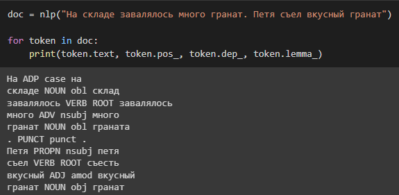{#fig:spacy_result_1}

Как можно заметить, получившийся в результате объект doc это набор токенов, на которые разбивается анализируемое предложение. У каждого токена имеется около 60 атрибутов[@spacy_token], в которых записана вся необходимая морфосинтаксическая информация.

uralicNLP как и spaCy - библиотека для обработки естественных языков, написанная на Python. Однако изначально она создавалась для работы лишь с языками уральской группы: финский, венгерский, эстонский и другие. На данный момент поддерживаются около 20 языков, включая русский. Для начала работы необходимо предварительно загрузить модель, которая поддерживает необходимый язык. Для загрузки моделей русского языка используется команда uralicApi.download("rus").

Как показано на рисунке [-@fig:uralicnlp_result_granat], результатом анализа является список всевозможных морфологических разборов для данного слова. Утверждается, что каждому разбору присваивается вероятность, а сам список отсортирован по этим вероятностям.

{#fig:uralicnlp_result_granat}

Получается, что в контексте морфологического анализа uralicNLP является аналогом Pymorphy за одним большим исключением: он не способен анализировать неологизмы, что для сравнения показано на рисунках [-@fig:uralicnlp_result_googlit] и [-@fig:pymorphy_result_googlit]

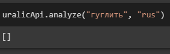{#fig:uralicnlp_result_googlit}

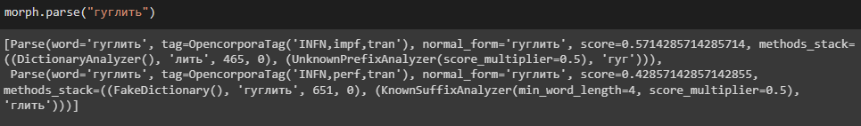{#fig:pymorphy_result_googlit}

### Результаты исследования

Для подведения итогов проведенного исследования опишем в таблице [-@tbl:analyzers] утвержденные ранее характеристики для каждого представленного инструмента морфологического анализа.

| Анализатор | EA   | SO   | IP                                                   | Tkn | TSC           | UW   |
| ---------- | ---- | ---- | ---------------------------------------------------- | --- | ------------- | ---- |
| Pymorphy   | 1    | --   | -- анализируемое слово                               | --  | Открытый      | +    |
| Snowball   | --   | --   | -- название языка, анализируемого текста             | --  | Открытый      | +    |
| TreeTagger | 0,86 | 0,65 | -- файл параметров языка                             | --  | Проприетарный | 1    |
| Mystem     | 0,8  | 0,5  | --                                                   | +   | Проприетарный | 0,98 |
| spaCy      | 0,9  | 0,67 | -- название модуля для языка, анализируемого текста  | +   | Открытый      | --   |
| uralicNLP  | 1    | --   | -- сокращенное название языка, анализируемого текста | --  | Открытый      | --   |

Table: Значение характеристик морфологических анализаторов. {#tbl:analyzers}

Исходя из представленных результатов можно сделать вывод об отсутствии универсального инструмента морфологического анализа. Никакой зависимости, которая могла бы выражаться в специфичных формах слов, контексте и тому подобном, между результатами работы каждого из представленных вариантов не наблюдается, что говорит об отсутствии какого-либо фаворита.

Также становится очевидна особенность инструментов, анализирующих только отдельные слова: полное отсутствие возможности снятия неоднозначности морфологического разбора. Однако ничего удивительного нет, поскольку это логичное следствие отсутствия контекста при морфологическом анализе.

Стоит также отметить обработку анализаторами незнакомых слов. Как можно заметить, у TreeTagger показатель эффективности анализа в данном случае лучше чем у остальных (плюсы означают наличие возможности обработки неологизмов, но отсутствие механизма выбора единственного варианта их разбора). Однако неожиданным результатом скорее является более низкий показатель Mystem, поскольку неологизмы образуются по известным языковым моделям[@воронцова2016неология] и такие сложные в анализе омонимии, как "уж", появиться не могут. Для примера рассмотрим неологизм "кринжовым", произошедший от английского слова "cringe". На рисунках [-@fig:tt_result_cringe] и [-@fig:mystem_result_cringe] показаны результаты анализа предложений со снятием омонимии. Видно, что Mystem определил слово "кринжовым" как существительное, а его лемму - "кринжов".

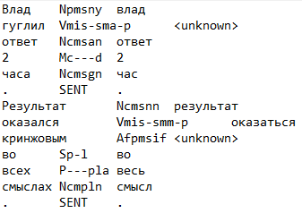{#fig:tt_result_cringe}

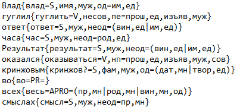{#fig:mystem_result_cringe}

После полученного результата было решено провести повторный анализ, но с учетом всех неоднозначностей, а также вероятностями каждого разбора. Полученный результат, представленный на рисунке [-@fig:mystem_result_cringe_weight], вызывает еще больше непонимания, поскольку вероятность того, что слово "кринжовым" является прилагательным, выше чем у остальных вариантов разбора.

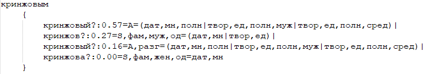{#fig:mystem_result_cringe_weight}

# Создание процедуры тестирования морфоанализаторов

## Разработка процедуры тестирования морфоанализаторов

## Программная реализация тестирования морфоанализаторов

# [Заключение]{custom-style="UnnumberedHeading1"} {.unnumbered}

# [Список использованных источников]{custom-style="UnnumberedHeading1"} {.unnumbered}

